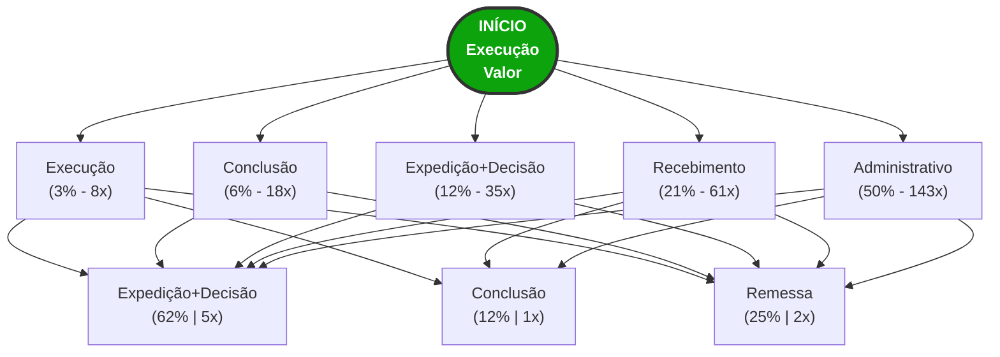

# Fluxograma Completo - Todas as Rotas

```mermaid
graph TD
    Start(["<b>INÍCIO</b><br/>Execução<br/>Valor"])

    P1_1["Administrativo<br/>(50% - 143x)"]
    Start --> P1_1
    P1_2["Recebimento<br/>(21% - 61x)"]
    Start --> P1_2
    P1_3["Expedição+Decisão<br/>(12% - 35x)"]
    Start --> P1_3
    P1_4["Conclusão<br/>(6% - 18x)"]
    Start --> P1_4
    P1_5["Execução<br/>(3% - 8x)"]
    Start --> P1_5

    %% Posição 2
    P2_1["Expedição+Decisão<br/>(38% | 70x)"]
    P1_1 --> P2_1
    P2_2["Remessa<br/>(28% | 52x)"]
    P1_1 --> P2_2
    P2_3["Conclusão<br/>(20% | 37x)"]
    P1_1 --> P2_3
    P2_1["Expedição+Decisão<br/>(33% | 20x)"]
    P1_2 --> P2_1
    P2_2["Conclusão<br/>(30% | 18x)"]
    P1_2 --> P2_2
    P2_3["Expedição<br/>(23% | 14x)"]
    P1_2 --> P2_3
    P2_1["Remessa<br/>(70% | 176x)"]
    P1_3 --> P2_1
    P2_2["Expedição<br/>(17% | 42x)"]
    P1_3 --> P2_2
    P2_1["Expedição<br/>(55% | 151x)"]
    P1_4 --> P2_1
    P2_2["Remessa<br/>(16% | 45x)"]
    P1_4 --> P2_2
    P2_1["Expedição+Decisão<br/>(62% | 5x)"]
    P1_5 --> P2_1
    P2_2["Remessa<br/>(25% | 2x)"]
    P1_5 --> P2_2
    P2_3["Conclusão<br/>(12% | 1x)"]
    P1_5 --> P2_3
    %% Posição 3
    %% Posição 4
    %% Posição 5
    %% Posição 6
    %% Posição 7

    %% Estilos
    classDef inicio fill:#0ca30c,stroke:#333,stroke-width:3px,color:#fff,font-weight:bold
    classDef processo fill:#3987e5,stroke:#333,stroke-width:2px,color:#fff
    class Start inicio
```
